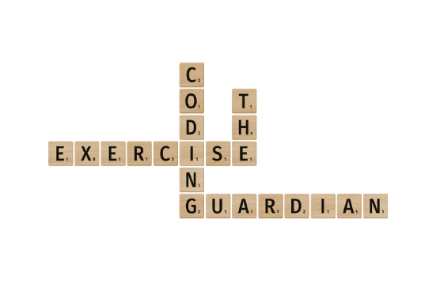

# Word Game (Scrabble)



## Background
This is a game where players attempt to create words from a set of letter tiles.
Different letters have different points allocated to them.

In the English alphabet, letters have the following point scores:

| Point(s) | Letter(s)                    |
| -----    | ---------------------------- |
| 1        | E, A, I, O, N, R, T, L, S, U |
| 2        | D, G                         |
| 3        | B, C, M, P                   |
| 4        | F, H, V, W, Y                |
| 5        | K                            |
| 8        | J, X                         |
| 10       | Q, Z                         |

For example, the word "GUARDIAN" has a score of 10:

```
GUARDIAN = 2 + 1 + 1 + 1 + 2 + 1 + 1 + 1 = 10
```

Letters also have the following distribution:

| Distribution | Letter(s)                 |
| -------------| ------------------------- |
| 12 tiles     | E                         |
| 9 tiles      | A, I                      |
| 8 tiles      | O                         |
| 6 tiles      | N, R, T                   |
| 4 tiles      | L, S, U, D                |
| 3 tiles      | G                         |
| 2 tiles      | B, C, M, P, F, H, V, W, Y |
| 1 tile       | K, J, X, Q, Z             |

## Tasks
1. Calculate the score for a word. The score is the sum of the points for the letters that make up a word.
   For example: GUARDIAN = 2 + 1 + 1 + 1 + 2 + 1 + 1 + 1 = 10.
1. Assign seven tiles chosen randomly from the English alphabet to a player's rack.
1. In the real game, tiles are taken at random from a 'bag' containing a fixed number of each tile.
   Assign seven tiles to a rack using a bag containing the above distribution.
1. Find a valid word formed from the seven tiles. A list of valid words can be found in [`dictionary.txt`](./dictionary.txt).
1. Find the longest valid word that can be formed from the seven tiles.
1. Find the highest scoring word that can be formed.
1. Find the highest scoring word if any one of the letters can score triple.
1. For discussion: how would we adapt our solution for a multiplayer environment?
